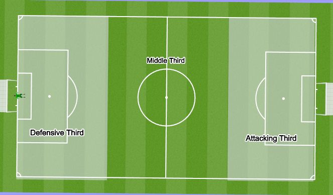
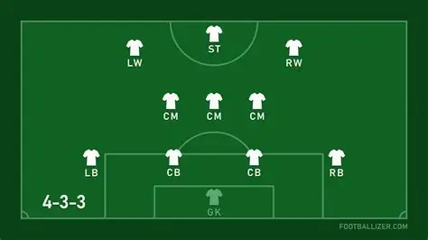
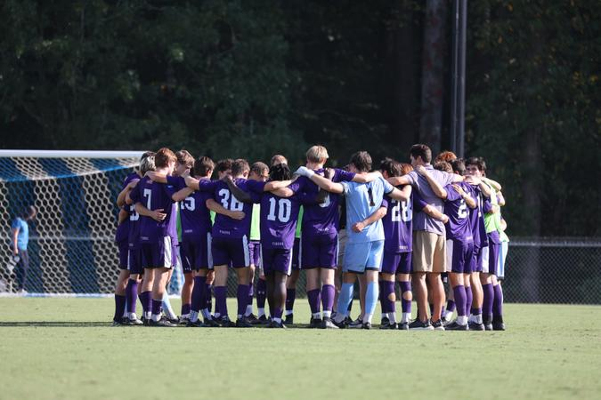

# Introduction

## Column {width=400}


&nbsp;&nbsp;&nbsp;&nbsp; The Men’s soccer team at Sewanee: The University of the South is a team on the rise looking to make an impact in conference play (Southern Athletic Association) and appear in the NCAA DIII tournament, a feat they’ve only accomplished once in program history. The program has an up and down history with only one conference championship in 2001. 

&nbsp;&nbsp;&nbsp;&nbsp; The team is young with 9 freshmen and 7 sophomores with many of these underclassmen starting or logging significant minutes and stats. Six of the top ten goalscorers on the team were underclassmen last season. So, it’s clear that this young team has lots of potential proven by their record from last season. And coach, Toni Pacella, is pulling in more talent with an incoming freshman class of 10 with much promise.

```{r setup, include=FALSE}
knitr::opts_chunk$set(echo = TRUE)

library(readxl)
library(dplyr)
library(readr)
library(ggplot2)
library(tidyr)
library(flexdashboard)
library(tinytable)
library(qwraps2)
library(knitr)

data<-read_excel("C:/Users/norab/repos/sewanee_soccer/data/app_data.xlsx")
data<-data%>%
  rename(Timestamp=`46131.461354166669`)

data<-data%>%
  rename(Type=fwrd_pass,
         Status=complete,
         third='attacking third')

pass_third_data<-data%>%
  filter(Type %in% c("fwrd_pass","bck_pass"))%>%
  group_by(third, Type)%>%
  summarise(count=n(), .groups="drop")

pass_third_data$third<- factor(pass_third_data$third, levels=c('attacking third','middle third','defensive third'))
pass_third_data$Type<- factor(pass_third_data$Type, levels=c('fwrd_pass','bck_pass'))
```


```{r, echo=FALSE}
record<- data.frame(
  Year = c('25-26','24-25','23-24','22-23'),
  Wins = c('12','6','6','13'),
  Losses = c('4','7','5','4'),
  Ties = c('4','4','6','0')
)

tt(record, caption="Record in Recent Years")
```
  
  
&nbsp;&nbsp;&nbsp;&nbsp; As the Sewanee Men’s soccer team develops and hopefully reaches new heights over the next few years, analyzing their tactics and playstyle can be helpful to understanding how they plan to capitalize on their talent pool.

&nbsp;&nbsp;&nbsp;&nbsp; Sewanee recently played a spring game against a solid Dalton State team who won the national championship for NAIA, the community college equivalent to NCAA, in 2024. Looking at the first ten minutes of the game is a great way to determine the probable tactics that Coach Pacella was using. Spring games are often a way for coaches to try out new play styles that they think could be effective for the regular season in the fall; therefore, examining statistics for the first 10 minutes of Sewanee’s game against Dalton State can provide an idea about how they plan to achieve success in the 2026 season.

## Column {width=300}

&nbsp;&nbsp;&nbsp;&nbsp; It’s important to note that if certain tactical approaches were unsuccessful, Coach Pacella would likely change them for the upcoming season. 



&nbsp;&nbsp;&nbsp;&nbsp; In soccer, the field is divided into 3 thirds, splitting the field into even pieces by its length. There is an attacking third, middle third, and defensive third for each team. One team’s attacking third is the other team’s defensive third. This part is pretty intuitive. What’s not so intuitive for someone who doesn’t watch soccer is how the different tactics in each third affect the game’s outcome. 

&nbsp;&nbsp;&nbsp;&nbsp; In order to break down Sewanee’s playstyle against Dalton State, a variety of attacking and defensive stats in each third of the field must be studied. These stats will help to shape the tactical identity of the team and how successful they could be in reaching the full potential of their young squad.


# Attack

## Column {width=450}

&nbsp;&nbsp;&nbsp;&nbsp; Passing and dribbling approach for each third of the field can be key in dissecting the tactics employed by Sewanee Men’s soccer against Dalton State. When looking at the passing stats, we see that the team is not afraid to possess the ball and has high numbers of both forwards and backwards passes in each third. There is a higher ratio of back passes in the defensive third as they want to minimize the risk of a counterattack so close to their own goal. 

```{r, echo=FALSE, fig.dim = c(5,3)}
# put in different r chunk
ggplot(pass_third_data, aes(
  x=third,
  y=count,
  fill=Type))+
  geom_col(stat="identity",position="dodge")+
  labs(
    title="The Passing Blueprint",
    subtitle="Number of Passes in Each Third",
    x="Third of the Field",
    y="Number of Passes",
    fill="Type of Pass"
  )+
  scale_fill_manual(
    values=c("fwrd_pass"='red',"bck_pass"='black') #change, too harsh
  ) #theme; gg_themes???

```

&nbsp;&nbsp;&nbsp;&nbsp; As they advance the ball up the field, they start to increase their number of forward passes, taking intentional risks to help with the end product: goals. It’s clear that they are not sitting back and waiting for the other team to make a mistake. Instead of relying on the counter attack, they prefer to control the ball and build calculated attacks. This is further reinforced by their consistent pass completion rate across every third of the field. The consistent number of passes in each third also illustrates that the team is trying to move the ball in between thirds, which forces the Dalton State defenders to move more and potentially open up gaps for Sewanee to exploit. 

&nbsp;&nbsp;&nbsp;&nbsp;Additionally, we see that Sewanee is not afraid to take on defenders in 1v1 situations to create attack. They have a high number of dribble attempts and a high dribble completion rate in the attacking third. They prefer not to do this as much in the middle and defensive thirds because again they like to maintain possession of the ball. 



## Column {width=25}

## Column {width=450}

```{r, echo=FALSE, fig.dim = c(5,3)}
pass_dribble_data<-data%>%
  filter(Type %in% c("fwrd_pass","bck_pass","dribble"))%>%
  mutate(Status = gsub('successful','complete', Status))
pass_dribble_data<-pass_dribble_data%>%
  mutate(Status = gsub('uncomplete','incomplete',Status))

pass_dribble_data<-pass_dribble_data%>%
  mutate(
    completion=case_when(
      Status %in% c("complete") ~ 1,
      Status %in% c("incomplete") ~ 0),
    action=case_when(
      Type %in% c("fwrd_pass", "bck_pass") ~ "pass",
      Type == "dribble" ~ "dribble"
    )
  )

pass_dribble_rate<-pass_dribble_data%>%
  group_by(third, action)%>%
  summarise(completion_rate = mean(completion), .groups="drop")

pass_dribble_rate<-pass_dribble_rate%>%
  mutate(third = factor(third, levels = c("attacking third","middle third","defensive third")))%>%
  mutate(action = factor(action, levels = c("pass","dribble")))

ggplot(pass_dribble_rate, aes(
  x=third,
  y=completion_rate,
  fill=action
  ))+
  geom_col(stat="identity", position=position_dodge(preserve="single"))+
  labs(
    title="Angle of Attack",
    subtitle="Pass and Dribble Competion by Third",
    caption="There were no dribbles attempted in the defensive third",
    x="Third of the Field",
    y="Completion Rate",
    color="Action"
  )+
  scale_fill_manual(
    values= c("pass"='yellow',"dribble"= 'turquoise')
  )
```


&nbsp;&nbsp;&nbsp;&nbsp;When you are on the ball, the opponent is not, meaning there is less threat for them scoring and more opportunities for you to attack. We see many top professional teams use similar tactics like Manchester City, Barcelona, and PSG. All of these teams have won a league title in their respective leagues in the past two years and are generally considered among the top teams in the world. 


```{r, echo=FALSE, fig.dim = c(5,3)}
ground_air_data<-pass_dribble_data%>%
  filter(Type == 'fwrd_pass')%>%
  group_by(third, ground)%>%
  summarise(count = n(), .groups="drop")%>%
  mutate(third = factor(third, levels = c('attacking third','middle third', 'defensive third')),
         ground = factor(ground, levels = c('ground','air')))

ggplot(ground_air_data, aes(
  x=third,
  y=count,
  fill=ground
))+
  geom_col(stat="identity", position=position_dodge(preserve="single"))+
  labs(
    title="Altitude of Attack",
    subtitle="Foward Pass Attempts on the Ground or in the Air by Third",
    caption="No Pass Attempts in the Air in the Defensive Third",
    x="Third of the Field",
    y="Number of Pass Attempts",
    fill="Type of Pass"
  )

```

&nbsp;&nbsp;&nbsp;&nbsp;However, the high possession of these teams is not fruitful if no risks are taken. And the same goes for Sewanee. When we consider Sewanee’s forward pass attempts, they increase the number of balls in the air when in or playing into the attacking third. This is one way they take risks in hope to score goals. So, it’s likely that they like to have quick ball movement on the ground to get defenders out of position and then play a dangerous ball in the air into the attacking third. Playing the ball in the air allows for more direct build up in which attackers can then get on the ball and take on their defenders; it’s an aggressive pass. 

&nbsp;&nbsp;&nbsp;&nbsp;Further, Sewanee minimizes the threat of counterattacks by not playing many balls in the air in their defensive and middle thirds. Sewanee’s pass distribution is skewed toward the attacking and middle thirds, illustrating that they like to have their defenders step up the field when in possession. This allows more people to get on the back which helps with more fluid attack. 


# Defense

## Column {width=400}

&nbsp;&nbsp;&nbsp;&nbsp;Sewanee’s approach to defense includes a high press from their attackers in which they attempt to force a mistake from the other team and win the ball higher up the field. This style can be risky as many numbers are committed forward, but it can also make it hard for the other team to adjust. Further, a high press can tire out the opposition making it easier to create chances as the game goes on. 

&nbsp;&nbsp;&nbsp;&nbsp;This style is apparent when looking at the pass completion for the other team in Sewanee’s attacking third because Sewanee allowed the fewest number of passes in their this part of the field, indicating that they were sending numbers forward and forcing Dalton State to make incomplete passes.

```{r, echo=FALSE, fig.dim = c(5,3)}
defense_data<-read_excel("C:/Users/norab/repos/sewanee_soccer/defense_data/defense_data.xlsx")
defense_data<-defense_data%>%
  rename(timestamp=`46134.173657407409`,
         action=pass_allowed,
         success=complete,
         third='attacking third')
pass_defense<-defense_data%>%
  group_by(action,success, third)%>%
  summarise(count = n(), .groups="drop")
pass_defense_filter<-pass_defense%>%
  filter(action == 'pass_allowed',
         success %in% c('complete','incomplete'))
pass_defense_filter$third<- factor(pass_defense_filter$third, levels = c('attacking third','middle third', 'defensive third'))

ggplot(pass_defense_filter, aes(
  x=third,
  y=count,
  fill=success
))+
  geom_col(stat="identity", position="dodge")+
  scale_fill_manual(
    values = c(complete='red',incomplete='green')
  )+
  labs(
    title="Tactics Against Passing",
    subtitle="Number of Passes for the Opposition",
    x="Third of the Field",
    y="Number of Passes",
    fill="Key"
  )+
  theme_light()
```

&nbsp;&nbsp;&nbsp;&nbsp;However, the flaws in the high press are demonstrated by the high numbers of passes completed in the middle and defensive thirds of Sewanee. Once Dalton State broke the high press and advanced the ball forward, Sewanee was exposed and they let Dalton State complete many passes. 

&nbsp;&nbsp;&nbsp;&nbsp;In these cases, Sewanee was saved by individual performances rather than a collective team press. Sewanee had a high success rate of tackles which mitigated the danger when Dalton State broke down their high press. However, relying on individual performances is not a sustainable play style in the long run, so Sewanee needs to maintain the integrity of their defensive shape for future games. 

## Column {width=400}
```{r, echo=FALSE, fig.dim = c(5,3)}

tackle_data<-defense_data%>%
  filter(action == 'tackle')
tackle_count_data<-tackle_data%>%
  group_by(success, third)%>%
  summarise(count = n(), .groups="drop")%>%
  mutate(third = factor(third, levels = c('attacking third','middle third','defensive third')),
         success = factor(success, levels = c('won','not won')))

ggplot(tackle_count_data, aes(
  x=third,
  y=count,
  fill=success
))+
  geom_col(stat="identity", position=position_dodge(preserve="single"))+
  scale_fill_manual(
    values = c(won='green','not won'='red')
  )+
  labs(
    title="Defensive Success on the Ground",
    subtitle="Number of Tackles Won by Third",
    x="Third of the Field",
    y="Number of Tackles",
    fill="Key",
    caption="No Tackles Not Won in the Attacking and Defensive Thirds"
  )

```

&nbsp;&nbsp;&nbsp;&nbsp;Another reason to employ a high press can also be to force the opponent to play the ball in the air so that Sewanee can win the ball with headers. But, they had a low success rate in winning headers, especially in the defensive third which further illustrates the problems with relying on individual performances when the high press fails. 

```{r, echo=FALSE, fig.dim = c(5,3)}

header_data<-defense_data%>%
  filter(action == 'header',
         third != 'attacking third')
header_data_filter<-header_data%>%
  mutate(third = factor(third, levels = c('middle third','defensive third')),
         success = factor(success, levels = c('won','not won')))
header_count_data<-header_data_filter%>%
  group_by(success, third)%>%
  summarise(count = n(), .groups="drop")

ggplot(header_count_data, aes(
  x=third,
  y=count,
  fill=success
))+
  geom_col(stat="identity",position="dodge")+
  scale_fill_manual(
    values = c(won='green','not won'='red')
  )+
  scale_y_continuous(limits = c(0,4))+
  labs(
    title="Defensive Success in the Air",
    subtitle="Number of Headers Won by Third",
    x="Third of the Field",
    y="Number of Headers",
    fill="Key",
    caption="No Headers in the Attacking Third"
  )
```

&nbsp;&nbsp;&nbsp;&nbsp;A high press can be valuable, but it wasn’t sustainable for the Sewanee as it requires more physical effort and is risky. This means that they perhaps can choose to start with a high press in games and then change their defensive approach in different phases of the game. Or, they must work on maintaining defensive shape to make the high press more dependable. This is what spring games are for, though. If Sewanee works to improve these areas in the fall pre-season, the high press could prove to be a key factor in future success for the program. Additionally, as they bring in more talent, the team will have more game-ready players that can contribute minutes to the physically taxing high press.

# Overview

## Column {width=400}

&nbsp;&nbsp;&nbsp;&nbsp; The Sewanee men’s soccer team and their coach make intentional tactical choices to drive the success of the team. They definitely have approaches that work, especially on the attacking side; however, a bit of work needs to be done on the defensive side. It would be beneficial if they made their tactics more adaptable, as well. Rigid tactics don’t hold against the constantly changing phases of the game, but a confident team with thorough tactics will know how to adjust to these changes. This is what should be Sewanee‘s main focus during the fall preseason in order to reach their fullest potential. These stats are pulled from 10 minutes of one game. Even though it seems Sewanee was doing better, there was actually little difference between the two teams' pass percentages.
```{r, echo=FALSE}
compare_table<-data.frame(
  'Total Pass Attempts' = c('58','34'),
  'Total Pass Completed' = c('44','26'),
  'Completion Percentage' = c('75.86', '76.47')
)
rownames(compare_table)<-c('Sewanee','Dalton State')
tt(compare_table, caption="Comparative Passing Data for the Teams")
```

&nbsp;&nbsp;&nbsp;&nbsp; Still, these stats are the most accurate reflection of Sewanee’s game plan as the ebbs and flows of the game had yet to take place. And they can be used to improve Suwanee’s place style in the future.

## Column {width=25}

## Column {width=400}

